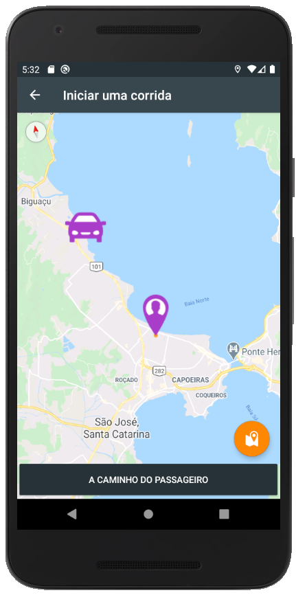

# Clone-Uber

Aplicativo clone para fins de conhecimento. [Baixar aplicativo](cloneUber.apk)

Este projeto simula o aplicativo real, onde é possível você se cadastrar e escolher seu tipo de perfil (como ira atuar) "motorista" ou "passageiro".

No perfil passageiro você tem a possibilidade de informar onde deseja ir e solictar um uber.

No perfil motorista você tem a possibilidade de identificar as corridas disponíveis (sabendo a distancia de seu cliente) e selecionar a que melhor lhe convir.

O aplicativo utiliza tecnologia Geofire e esta integrado com o Firebase, utilizando os módulos Authentication e Realtime Database.

1. Tela de login.

2. Tela de acesso.

3. Tela de cadastro.

4. Tela perfil motorista - Atender uma viagem

5. Tela perfil passageiro - Iniciar uma viagem

6. Tela perfil motorista - A caminho do passageiro

7. Tela perfil motorista - Maps

8. Telas perfil motorista e passageiro durante o processo

8. Organização dados no Firebase

